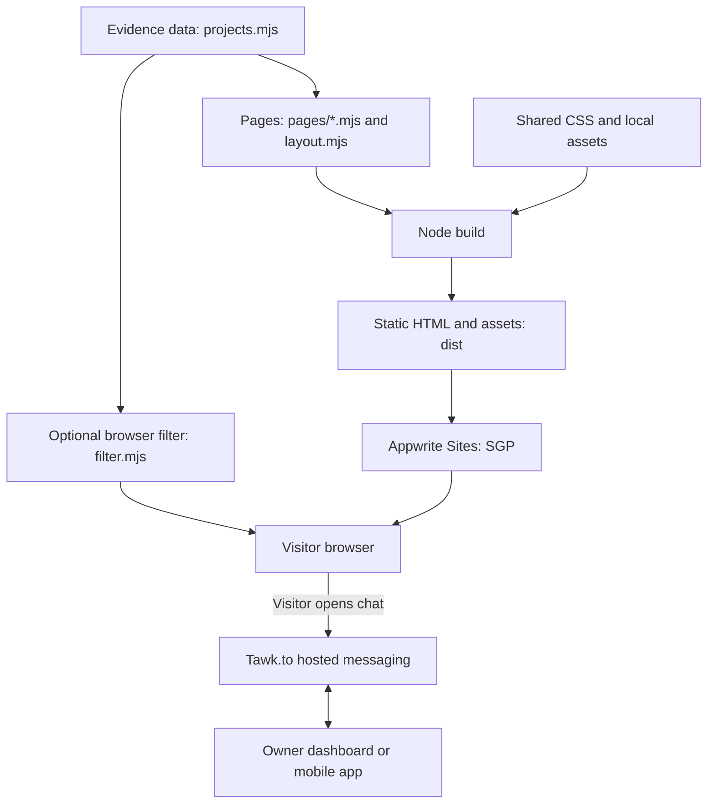
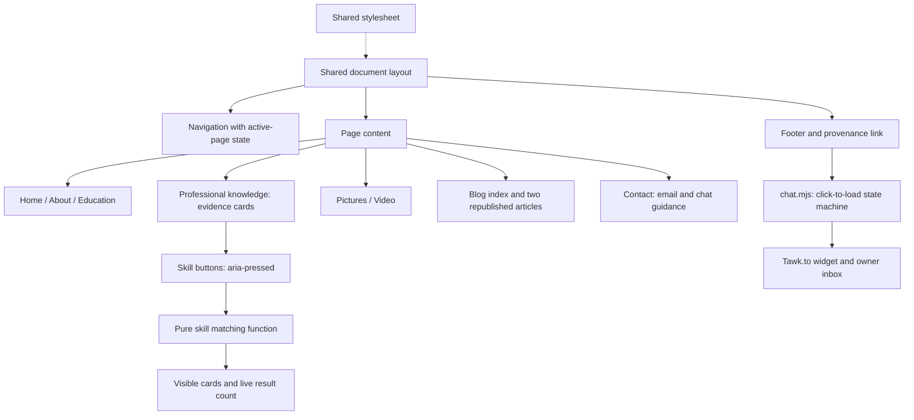
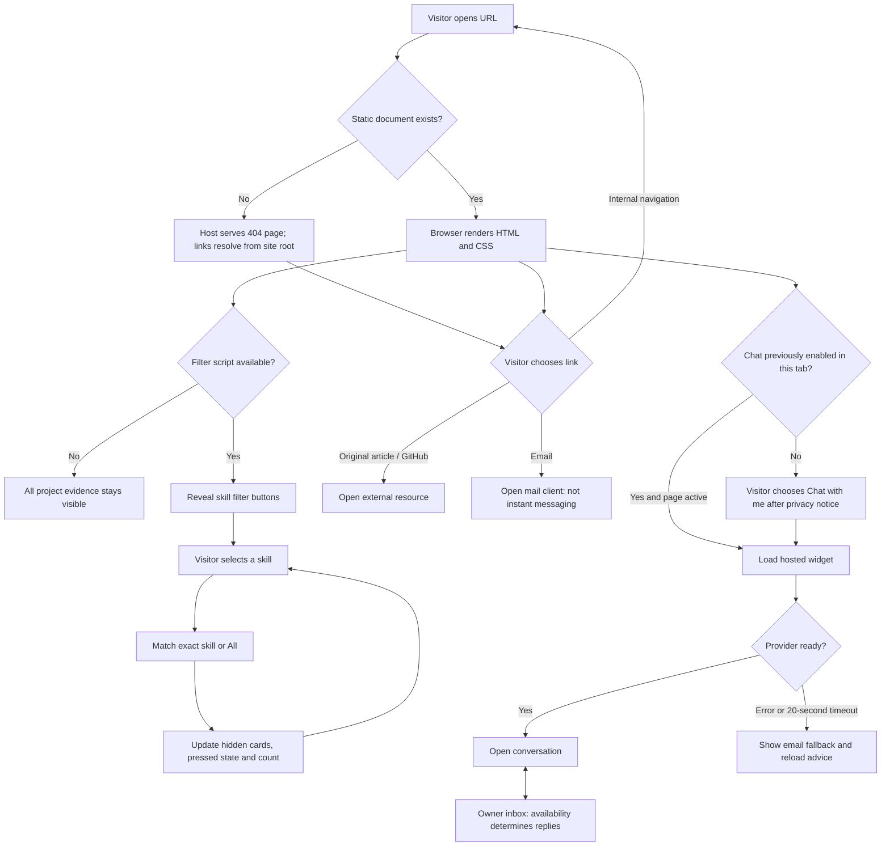

# Design: evidence and progressive enhancement iteration

## Decisions

Actual HTML documents avoid SPA fallback/routing configuration and work without client JavaScript. A single build-time layout avoids duplicated navigation. Content and presentation are separate. Use Node's built-in filesystem utilities; no framework dependencies. Trade-off: editing content requires rebuilding/deploying; no CMS. Messaging depends on Tawk.to rather than a custom backend.

Tokens: paper `#ffffff`, background `#f3f6fa`, ink `#192b40`, blue `#174a79`, muted `#506278`, divider `#d7e0ea`. Georgia headings; system sans-serif text. Desktop navigation rail becomes a wrapping top navigation on narrow screens. Focus is visible; no animations or remote fonts.

## Sitemap

Home → About · Education · Professional knowledge · Pictures · Video · Blog · Contact.
Blog → two complete republished articles (“How we solved logging at Appwrite” and “How I built the Appwrite MCP server”), each linking to its original. Professional knowledge → filter by skill → linked project evidence. Contact offers email and hosted Tawk.to chat. A shared footer button loads the provider after an explicit visitor click and privacy notice. The choice is remembered for the tab; later active pages warm the widget in the background. Video is a clearly marked unfinished page until a real video is selected.

## Block diagram

## Component diagram

## Control-flow diagram

The widget has been integrated and visitor-side loading/message entry tested. Owner inbox receipt is confirmed, and a labelled reply was sent from the dashboard. On 1 October a dashboard reply appeared in the live visitor widget, so messaging is verified in both directions. Public widget identifiers are not credentials. The provider does not load before the first opt-in or while a document is prerendered. After opt-in, sessionStorage allows background loading on subsequent active pages. The application does not request that background readiness open the conversation. Provider outages can still delay or prevent readiness. Innovation implemented: skills-to-project evidence filtering, with keyboard-operable buttons and an all-content fallback when JavaScript is unavailable. This is an application-specific enhancement, not a novel filtering algorithm.
