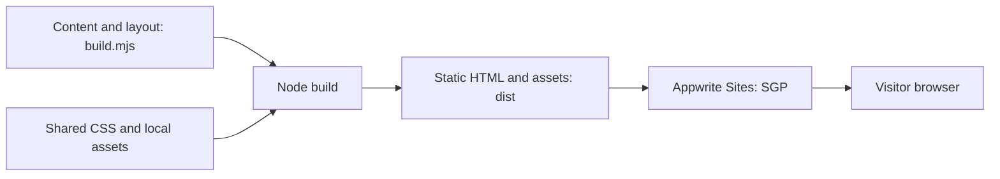
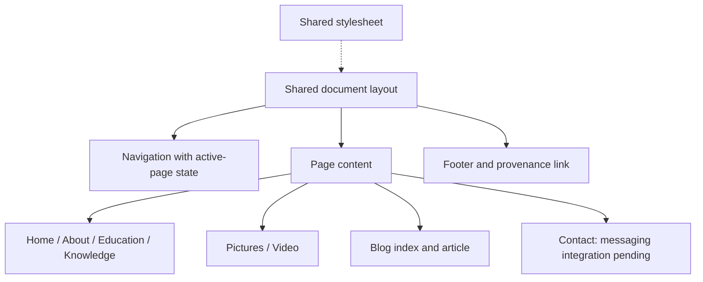
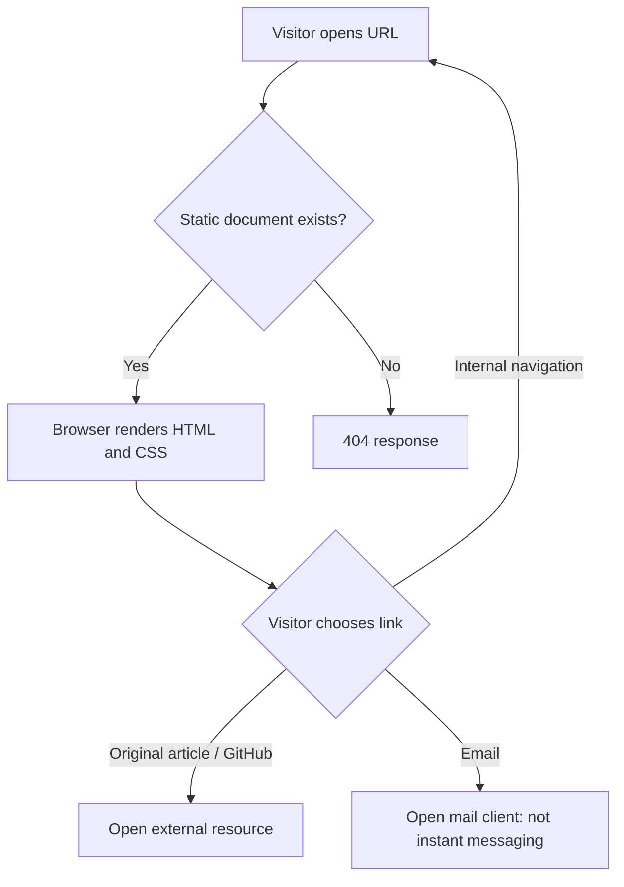

# Design — initial implementation

## Decisions

Actual HTML documents avoid SPA fallback/routing configuration and work without client JavaScript. A single build-time layout avoids duplicated navigation. Content and presentation are separate. Use Node's built-in filesystem utilities; no framework dependencies. Trade-off: editing content requires rebuilding/deploying; no CMS or private messaging yet.

Tokens: paper `#ffffff`, background `#f3f6fa`, ink `#192b40`, blue `#174a79`, muted `#506278`, divider `#d7e0ea`. Georgia headings; system sans-serif text. Desktop navigation rail becomes a wrapping top navigation on narrow screens. Focus is visible; no animations or remote fonts.

## Sitemap

Home → About · Education · Professional knowledge · Pictures · Video · Blog · Contact.
Blog → local article excerpt → original full article. Contact is currently email only and **does not satisfy instant messaging**. Video is a clearly marked unfinished page until a real video is selected.

## Block diagram

## Component diagram

## Control-flow diagram

These diagrams document the current foundation, not unimplemented messaging. Update them after integration. Innovation proposal: skills-to-project evidence filtering; not yet implemented or claimed.
